<p align="center">
  
</p>

<h3 align="center">The Agentic Development Environment</h3>

<p align="center">
  <a href="https://github.com/Birdhouse-Labs/birdhouse">
    
  </a>
</p>

<p align="center">If Birdhouse is useful to you, <a href="https://github.com/Birdhouse-Labs/birdhouse">give us a star ⭐</a> — it's a vote from the community that keeps us working on this.</p>

<p align="center">
  <a href="https://youtu.be/FosIwtyyaLY">
    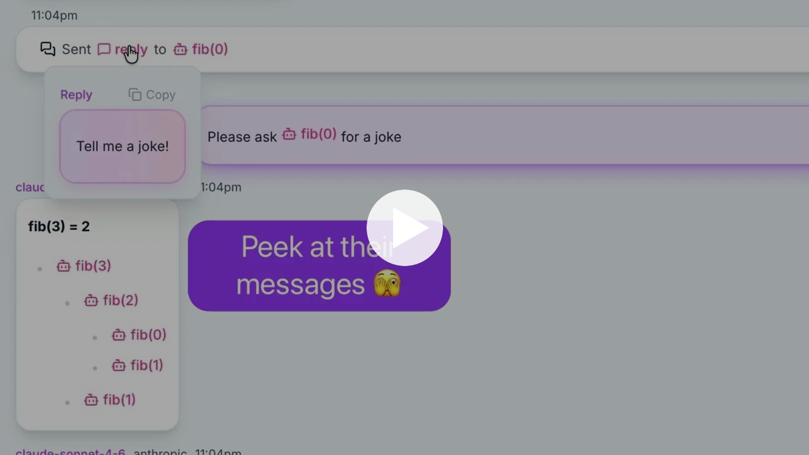
  </a>
</p>
<p align="center"><a href="https://youtu.be/FosIwtyyaLY"><em>▶ Watch the demo (3 min)</em></a></p>

---

Birdhouse is built around a simple belief: **the agent is the unit of work.**

Other tools bolt AI onto a text editor or terminal. Birdhouse starts from scratch and asks — *what does software look like when agents are doing most of the work?* What does a developer need to see, control, and organize?

We don't have a built-in text editor. We don't have a built-in terminal. We have the features that matter most when you're orchestrating agents — and we've obsessed over getting them right.

> ⚡ **Birdhouse runs in YOLO mode.** No confirmation dialogs, no tool call approvals — agents just go. If you're not comfortable running agents without guardrails, Birdhouse is probably not for you yet.

<p align="center"><em>"You will not lose your job to AI, but will lose it to someone who uses it."</em></p>
<p align="center"><strong>Jensen Huang</strong> &nbsp;·&nbsp; Nvidia</p>

---

## Installation

**macOS only** (Apple Silicon and Intel). Requires no runtime — just run the one-liner:

```bash
curl -fsSL https://raw.githubusercontent.com/birdhouse-labs/birdhouse/main/install.sh | bash
```

This downloads the latest release from GitHub, verifies the SHA256 checksum, extracts to `~/.birdhouse/`, and adds `~/.birdhouse/bin` to your shell profile. You can [read the install script](install.sh) before running it.

Once installed, navigate to any project directory and run:

```bash
birdhouse ui
```

---

## Table of Contents

- [Agent Tree](#-agent-tree)
- [Agent Navigation](#-agent-navigation)
- [Agent Communication](#-agent-communication)
- [Clone & Send](#️-clone--send)
- [Stop, Queue & Reset to Here](#️-stop-queue--reset-to-here)
- [Clone from Here](#-clone-from-here)
- [Skills](#️-skills)
- [Themes](#-themes)
- [Workspaces](#️-workspaces)
---

## Features

### 🌳 Agent Tree

Every agent you create — and every agent *they* create — is organized into a live, visual tree. You can see what's running, what's waiting, and what's done at a glance.

Your entire history, always visible. No pagination, no "load more" — every agent in your tree is right there, searchable, at a glance.

> *"Knowing what your agent is doing is engineering. Not knowing is vibe coding."*
> — [IndyDevDan](https://www.youtube.com/@IndyDevDan)

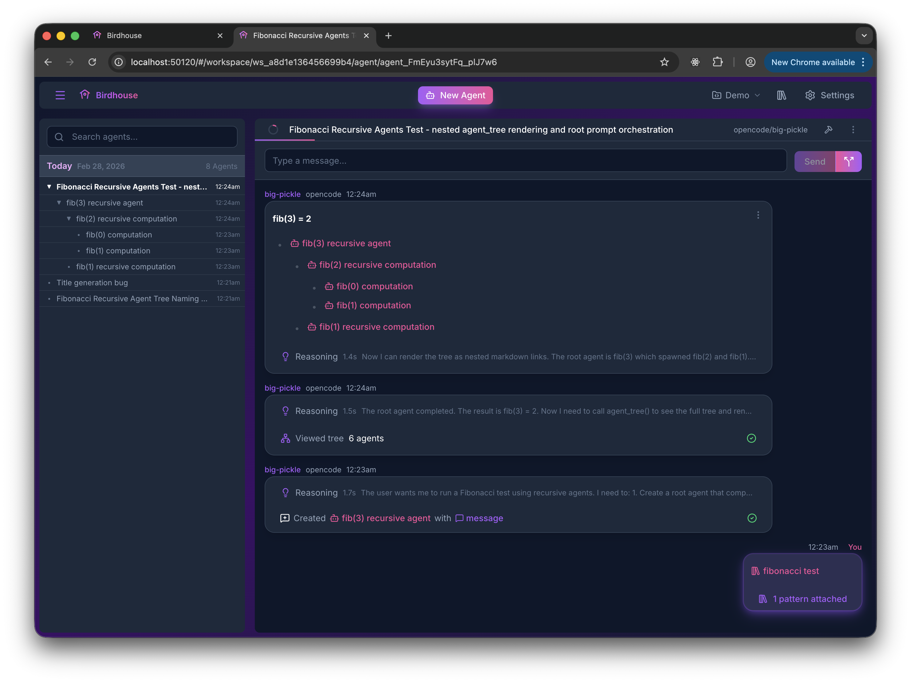

---

### 🔍 Agent Navigation

Click any agent in the tree to jump straight to it. Or, drill into any agent as a modal — layered on top of whatever you're already reading, scroll position intact.

Close it, and you're right back where you were. Open another one on top of that. There's no limit to how deep you can go.

It's the difference between *navigating away* and *peeking in* — and once you've used it, you won't want to go back.

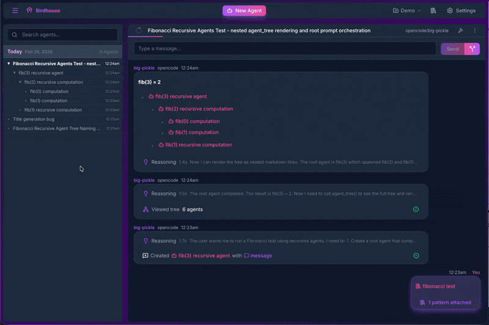

---

### 💬 Agent Communication

Agents can talk to each other. An agent mid-task can ask a question, get an answer from a sibling or parent agent, and keep going — without you playing telephone in the middle.

Not just agents running in parallel. Agents that *collaborate*.

> **Note:** Agent communication has been primarily tested with Anthropic's Sonnet and Opus models. Your mileage may vary with other providers.

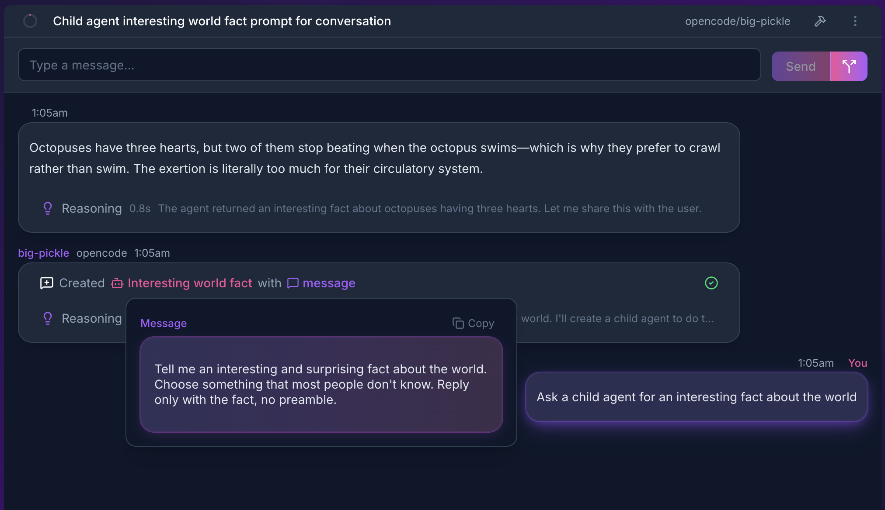
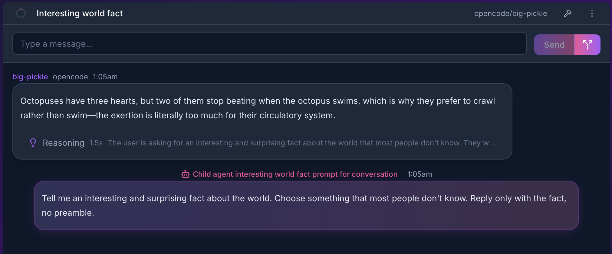


---

### ✂️ Clone & Send

Take any agent and clone it — branching the conversation from that exact moment into a new direction. Send the clone off to explore while the original keeps going.

**It even works while the agent is mid-task.** You don't have to wait.

Perfect for side quests — paths you'd love to explore but don't want to burn context on in your current chat.

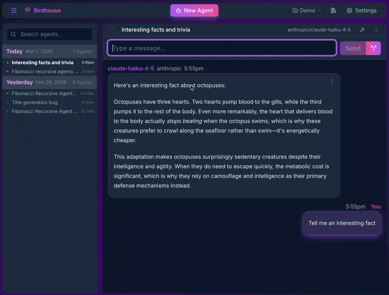

---

### ⏹️ Stop, Queue & Reset to Here

The basics, done right.

- **Stop** — halt an agent instantly
- **Queue** — line up your next message while the agent is still working
- **Reset to here** — rewind to any message and branch from there

Boring? Maybe. But you'd be surprised how many tools get these wrong.

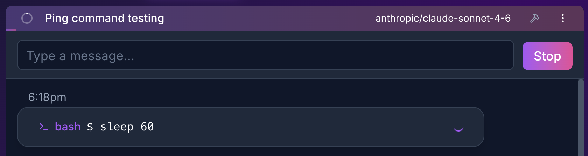
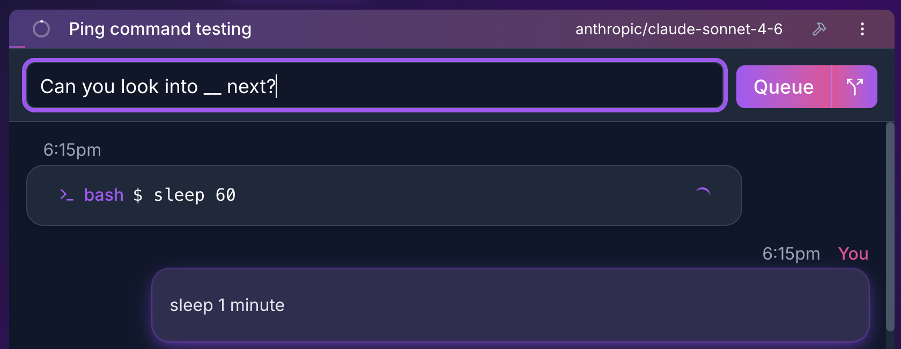
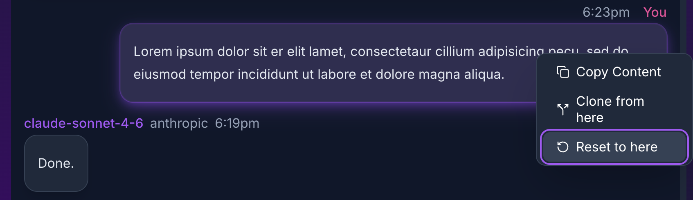

---

### 🔀 Clone from Here

Not just from the current state — from *any point* in the conversation. Click any message, clone from there, and you have a fresh agent with full context up to that moment.

Branch from your best ideas, not just your latest ones.


---

### 🛠️ Skills

> ⚠️ **Skills support is under active development.**

Birdhouse supports the community skills ecosystem. Install any skill from [skills.sh](https://skills.sh) and it's available inside your agents instantly.

The best part: as you type, a typeahead dropdown pops up matching your skills in real time. Arrow keys to navigate, Enter to select — and the skill drops right into your message. You define the trigger phrases yourself, so it feels like the tool learned your vocabulary.


---

### 🎨 Themes

Code themes and UI themes are **independent**. Pick a UI that feels right, pick a code highlight style that doesn't make your eyes bleed — mix and match freely.

Every VS Code theme is supported. If it works in your editor, it works in Birdhouse.

We think this one is better shown than described.

<table>
<tr>
<td>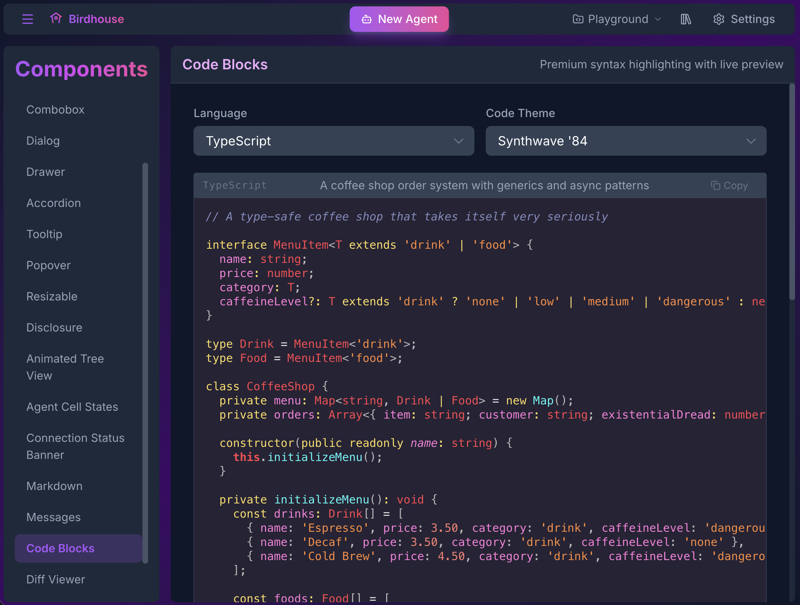</td>
<td>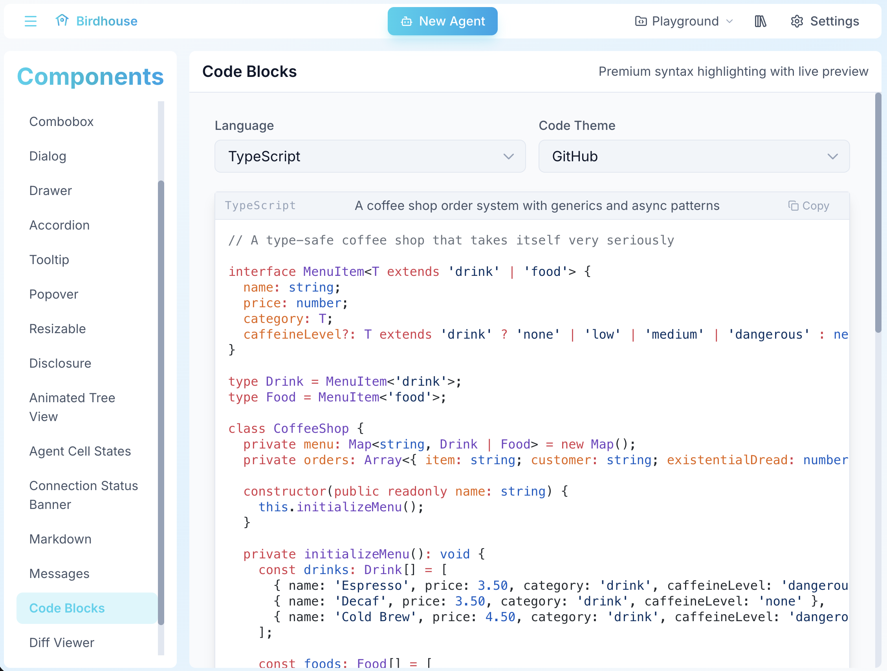</td>
</tr>
<tr>
<td>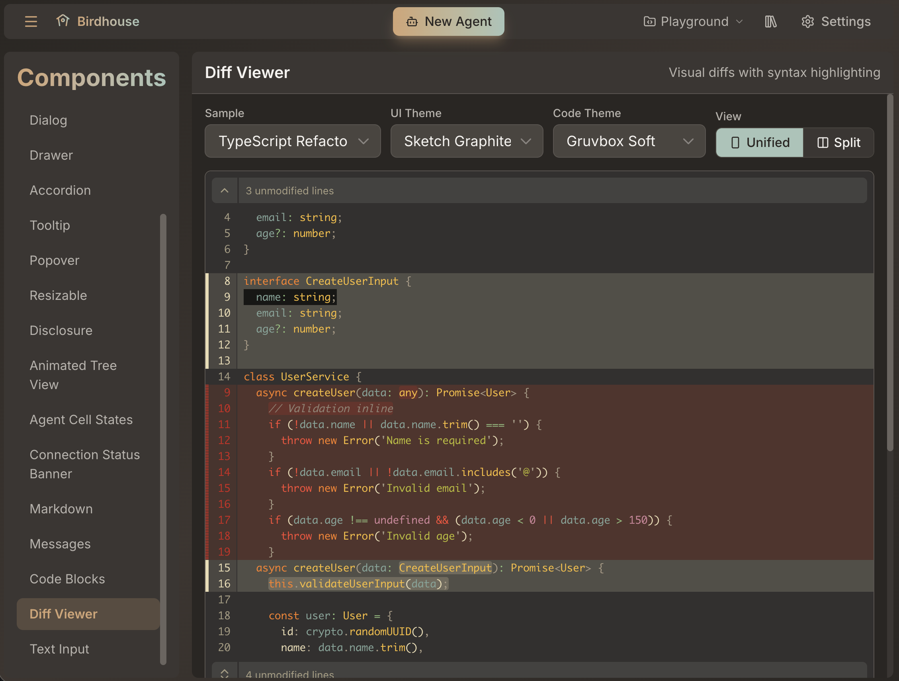</td>
<td>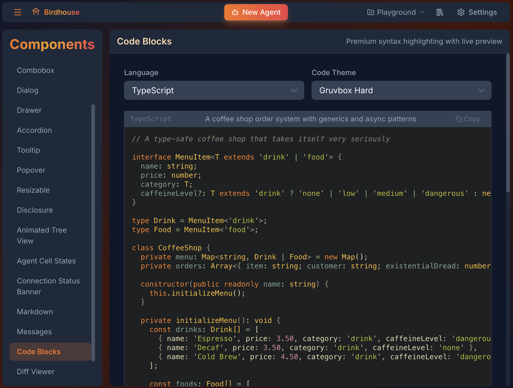</td>
</tr>
</table>

---

### 🗂️ Workspaces

Workspaces are **not projects**. They are not git repos.

A workspace is a directory on your machine, paired with a complete configuration: which MCP tools are available, which skills are loaded, and which API keys and AI providers to use. Agents live inside a workspace and inherit all of it.

Most tools organize around your codebase. Birdhouse organizes around your context. A real setup might look like:

- **Acme Corp** — work directory, Slack + Jira MCPs, work Anthropic key, company-specific skills
- **Personal** — home directory, personal API keys, your own skills
- **Open Source** — separate credentials, community skills, clean agent history

Switch workspaces and everything changes — tools, keys, agents. None of your work contexts bleed into each other.

Birdhouse is provider agnostic. Anthropic, OpenAI, Google, or anything else supported by OpenCode — each workspace can use a different one. Use the model that makes sense for the work, not the one you happened to set up first.

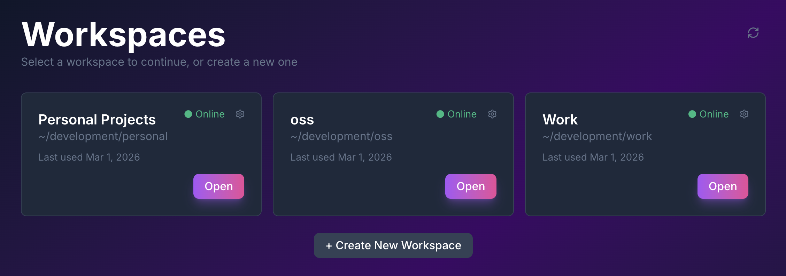

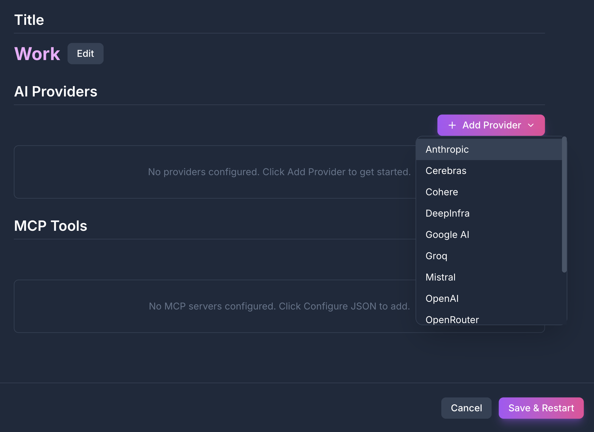

---

## Standing on Shoulders

Birdhouse wouldn't exist without [OpenCode](https://opencode.ai) — the open source agent runtime that powers everything under the hood. If Birdhouse is the cockpit, OpenCode is the engine. Go give them a star.

---

## License

MIT — free to use, fork, and build on.

---

<p align="center">If Birdhouse is useful to you, <a href="https://github.com/Birdhouse-Labs/birdhouse">give us a star ⭐</a> — it's a vote from the community that keeps us working on this.</p>
<p align="center">
  <a href="https://github.com/Birdhouse-Labs/birdhouse">
    
  </a>
</p>
