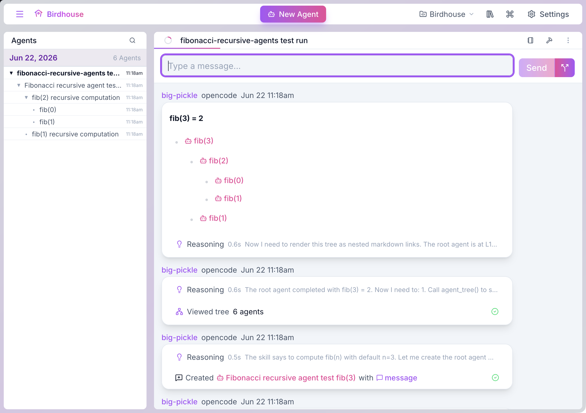

<p align="center">
  <svg width="32" height="32" viewBox="0 0 24 24" fill="none" xmlns="http://www.w3.org/2000/svg">
    <path d="M12 18v4" fill="none" stroke="#7C3AED" stroke-width="2" stroke-linecap="round" stroke-linejoin="round"/>
    <path d="m17 18 1.956-11.468" stroke="#7C3AED" stroke-width="2" stroke-linecap="round" stroke-linejoin="round"/>
    <path d="m3 8 7.82-5.615a2 2 0 0 1 2.36 0L21 8" stroke="#7C3AED" stroke-width="2" stroke-linecap="round" stroke-linejoin="round"/>
    <path d="M4 18h16" stroke="#7C3AED" stroke-width="2" stroke-linecap="round" stroke-linejoin="round"/>
    <path d="M7 18 5.044 6.532" stroke="#7C3AED" stroke-width="2" stroke-linecap="round" stroke-linejoin="round"/>
    <circle cx="12" cy="10" r="2" stroke="#7C3AED" stroke-width="2" stroke-linecap="round" stroke-linejoin="round"/>
  </svg>
</p>

<h2 align="center">birdhouse</h2>

<p align="center">A UI for your AI agents — built on <a href="https://opencode.ai">OpenCode</a></p>

<p align="center">
  <a href="https://github.com/Birdhouse-Labs/birdhouse">
    
  </a>
</p>

---

Birdhouse is an open source UI for [OpenCode](https://opencode.ai), built around agent teams. Where OpenCode gives you a powerful agent in the terminal, Birdhouse gives you a browser-based environment designed around orchestrating many agents at once.

Birdhouse is built around a simple belief: **the agent is the unit of work.**

Other tools bolt AI onto a text editor or terminal. Birdhouse starts from scratch and asks — *what does software look like when agents are doing most of the work?* What does a developer need to see, control, and organize?

We don't have a built-in text editor. We don't have a built-in terminal. We have the features that matter most when you're orchestrating agents — and we've obsessed over getting them right.

> ⚡ **Birdhouse runs in YOLO mode.** No confirmation dialogs, no tool call approvals — agents just go. If you're not comfortable running agents without guardrails, Birdhouse is probably not for you yet.

<p align="center">
  
</p>

---

## Installation

**macOS only** (Apple Silicon and Intel). Requires no runtime — just run the one-liner:

```bash
curl -fsSL https://raw.githubusercontent.com/birdhouse-labs/birdhouse/main/install.sh | bash
```

This downloads the latest release from GitHub, verifies the SHA256 checksum, extracts to `~/.birdhouse/`, and adds `~/.birdhouse/bin` to your shell profile. You can [read the install script](install.sh) before running it.

Once installed, navigate to any project directory and run:

```bash
birdhouse ui
```

---

## Table of Contents

- [Agent Tree](#-agent-tree)
- [Transparent by Default](#️-transparent-by-default)
- [Agent Navigation](#-agent-navigation)
- [Agent Communication](#-agent-communication)
- [Clone & Send](#️-clone--send)
- [Stop, Queue & Reset to Here](#️-stop-queue--reset-to-here)
- [Clone from Here](#-clone-from-here)
- [Typeahead](#️-typeahead)
- [Agent Search](#-agent-search)
- [Themes](#-themes)
- [Workspaces](#️-workspaces)

---

## Features

### 🌳 Agent Tree

Every agent you create — and every agent *they* create — is organized into a live, visual tree. You can see what's running, what's waiting, and what's done at a glance.

Your entire history, always visible. No pagination, no "load more" — every agent in your tree is right there, searchable, at a glance.

---

### 👁️ Transparent by Default

Every tool call, every reasoning step, every message between agents — surfaced in the UI. You always know what your agents are doing and why.

> *"Knowing what your agent is doing is engineering. Not knowing is vibe coding."*
> — [IndyDevDan](https://www.youtube.com/@IndyDevDan)

---

### 🔍 Agent Navigation

Click any agent in the tree to jump straight to it. Or, drill into any agent as a modal — layered on top of whatever you're already reading, scroll position intact.

Close it, and you're right back where you were. Open another one on top of that. There's no limit to how deep you can go.

It's the difference between *navigating away* and *peeking in* — and once you've used it, you won't want to go back.

---

### 💬 Agent Communication

Birdhouse ships a provider-agnostic agent communication toolkit built into every agent:

- **`agent_create`** — spawn a new agent with a prompt
- **`agent_reply`** — send a follow-up message to any agent
- **`agent_read`** — read another agent's conversation and results
- **`agent_tree`** — view the full agent hierarchy from anywhere in the tree

Agents can talk to each other, delegate work, read each other's output, and make decisions based on what their siblings are doing — without you playing telephone in the middle.

Want to test how Opus vs Sonnet vs your local model handle the same task? Have an orchestrator spawn all three and compare. The tools work the same regardless of which provider each agent is using.

Not just agents running in parallel. Agents that *collaborate*.

---

### ✂️ Clone & Send

Take any agent and clone it — branching the conversation from that exact moment into a new direction. Send the clone off to explore while the original keeps going.

**It even works while the agent is mid-task.** You don't have to wait.

Perfect for side quests — paths you'd love to explore but don't want to burn context on in your current chat.

---

### ⏹️ Stop, Queue & Reset to Here

The basics, done right.

- **Stop** — halt an agent instantly
- **Queue** — line up your next message while the agent is still working
- **Reset to here** — rewind to any message and branch from there

Boring? Maybe. But you'd be surprised how many tools get these wrong.

---

### 🔀 Clone from Here

Not just from the current state — from *any point* in the conversation. Click any message, clone from there, and you have a fresh agent with full context up to that moment.

Branch from your best ideas, not just your latest ones.

---

### ⌨️ Typeahead

As you type, a dropdown pops up matching your installed skills in real time. Arrow keys to navigate, Enter to select — and the skill drops right into your message.

You define the trigger phrases yourself, so it feels like the tool learned your vocabulary.

---

### 🔎 Agent Search

Search across every agent you've ever created — not just titles, but message content and tool calls too. Find the agent that ran a specific command, wrote a specific file, or said a specific thing.

Your agent history isn't an archive. It's a searchable knowledge base.

---

### 🎨 Themes

Code themes and UI themes are **independent**. Pick a UI that feels right, pick a code highlight style that doesn't make your eyes bleed — mix and match freely.

Every VS Code theme is supported. If it works in your editor, it works in Birdhouse.

---

### 🗂️ Workspaces

Each workspace is a fully separate and segregated OpenCode instance — its own tools, environment variables, API keys, skills, and agent history. Nothing bleeds between them.

A real setup might look like:

- **Acme Corp** — work directory, Slack + Jira MCPs, work Anthropic key, company-specific skills
- **Personal** — home directory, personal API keys, your own skills
- **Open Source** — separate credentials, community skills, clean agent history

Switch workspaces and you're in a completely different context. Use the model and provider that makes sense for the work, not the one you happened to set up first.

---

## Standing on Shoulders

Birdhouse wouldn't exist without [OpenCode](https://opencode.ai) — the open source agent runtime that powers everything under the hood. If Birdhouse is the cockpit, OpenCode is the engine. Go give them a star ⭐

---

## License

MIT — free to use, fork, and build on.

---

<p align="center">If Birdhouse is useful to you, <a href="https://github.com/Birdhouse-Labs/birdhouse">give us a star ⭐</a> — it's a vote from the community that keeps us working on this.</p>
<p align="center">
  <a href="https://github.com/Birdhouse-Labs/birdhouse">
    
  </a>
</p>
